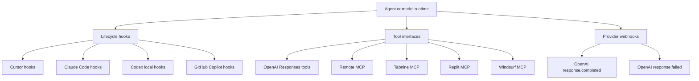
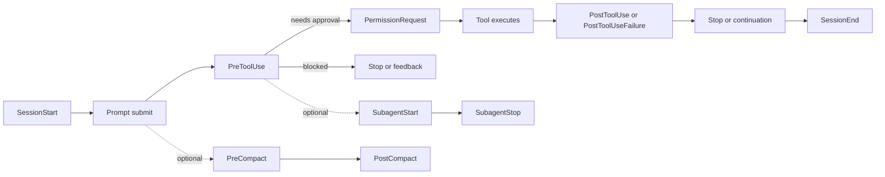
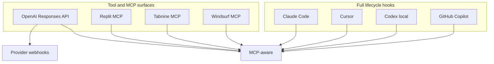
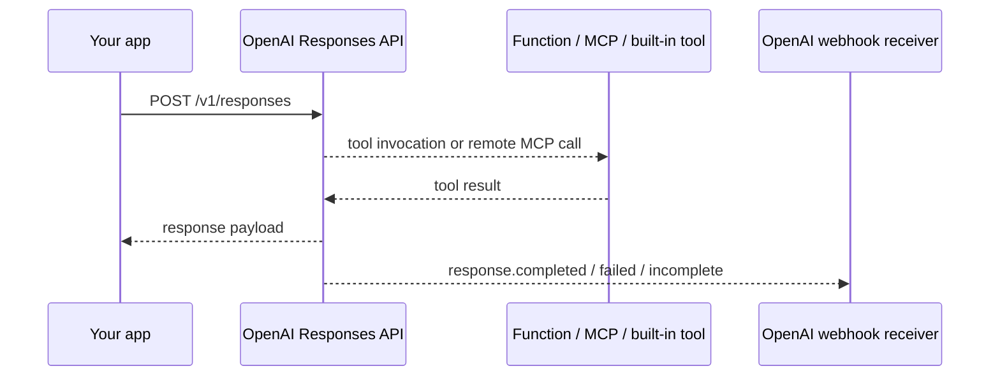

# Current Hook Surfaces Across Major Coding Agents

## Executive summary

The current market splits into three distinct extensibility models.

First, **full lifecycle-hook systems** exist today in **Anthropic Claude Code**, **Cursor**, **OpenAI Codex local clients**, and **GitHub Copilot’s cloud agent / CLI**. Among them, **Claude Code is the richest and most formally documented**: it exposes the broadest event model, supports five handler types (`command`, `http`, `mcp_tool`, `prompt`, `agent`), and documents detailed per-event schemas, matcher rules, async execution, and decision semantics. **Cursor** also has a substantial lifecycle system, but it is primarily **script/stdin-stdout based**, with separate Agent and Tab hook families and enterprise distribution controls. **Codex** currently exposes a **much narrower, experimental local hook system** behind a feature flag, with only five documented hook events and important unsupported behaviors that “fail open.” **GitHub Copilot** now has a practical hook system for its cloud agent and CLI, but it is **command-only**, narrower than Claude/Cursor, and its documentation is split between conceptual and reference pages. citeturn18view0turn9view0turn41view0turn30view2turn30view0

Second, several platforms expose **tool-extension surfaces but not first-class lifecycle hooks**. In the official material retrieved here, **Replit**, **Tabnine**, and **Windsurf/Codeium** fit this pattern. Their extensibility centers on **MCP servers, tool permissions, guidelines/custom instructions, and integrations**, not on per-event callback hooks like `PreToolUse` or `Stop`. For migration planning, that is the single most important distinction: these products are extensible, but **not hook-compatible in the Claude/Cursor/Codex/Copilot sense**. citeturn3search8turn3search11turn3search13turn3search6turn3search9turn3search10turn3search12turn1search6

Third, **OpenAI’s public coding APIs** expose something different again: **tool calling, remote MCP, built-in tools, and provider webhooks**. These are powerful, but they are **not local agent lifecycle hooks**. In the OpenAI stack, the closest equivalents are: **Codex local hooks** for local clients; **Responses API tools/function calling/custom tools/remote MCP** for model-to-app invocation; and **OpenAI webhooks** such as `response.completed` / `response.failed` for provider-to-app asynchronous notification. Treating these as equivalent to Claude/Cursor hook events is a category error and is the source of many migration failures. citeturn41view0turn39view4turn39view5turn43view4turn43view5

The most important incompatibilities are semantic, not cosmetic. Examples: **Claude’s `PreToolUse` can ask, deny, or defer; Cursor’s `preToolUse` accepts `ask` in schema but does not enforce it today; Codex parses several decision fields but many are not supported yet; GitHub Copilot documents `allow` / `deny` / `ask` in its pre-tool output, but states that only `deny` is currently processed**. Similarly, **Cursor and Claude have explicit compaction hooks**, **Codex does not**, and **Copilot’s docs list `agentStop` / `subagentStop` conceptually but the current hook reference does not provide equally detailed per-event schemas for them**. citeturn21view3turn9view0turn41view1turn32view0turn18view0turn30view2turn30view0

## What qualifies as a hook in this report

This report separates three categories that vendors sometimes blur in marketing:

In this report, **lifecycle hooks** means event-driven callbacks tied to an agent runtime, such as session start, prompt submission, tool invocation, or agent stop. **Tool interfaces** means model- or agent-callable tools such as function calling or MCP servers. **Provider webhooks** means outbound HTTP notifications from a hosted provider. This distinction is explicit in the official docs for Claude Code, Cursor, Codex, GitHub Copilot, and OpenAI’s Responses/Webhooks APIs. citeturn18view0turn9view0turn41view0turn30view2turn39view4turn39view5turn43view4turn43view5

Methodologically, I prioritized **primary documentation** and treated missing vendor documentation as a real product limitation for migration purposes. Where a vendor has **no documented lifecycle hook system**, I mark that as **“no documented first-party lifecycle hooks found”** rather than inferring hidden capability. citeturn18view0turn9view0turn41view0turn30view2turn3search8turn3search6turn1search6

## Agent-by-agent mapping

The table below consolidates the current official hook or hook-adjacent surfaces for the requested agents. For agents without a first-party lifecycle hook model, the row lists the official extensibility mechanism that exists instead. Sources in the rightmost column are the official documents supporting the row. citeturn18view0turn9view0turn41view0turn30view2turn30view0turn3search8turn3search6turn1search6turn39view4turn39view5

| Agent | First-class lifecycle hooks | Hook names or exposed surfaces | Handler / signature shape | Trigger conditions | Input / output schema summary | Auth / permission model | Limits / quotas | Environments | Extensibility / custom hooks | Official docs |
|---|---|---|---|---|---|---|---|---|---|---|
| **Cursor** | **Yes** | Agent hooks: `sessionStart`, `sessionEnd`, `preToolUse`, `postToolUse`, `postToolUseFailure`, `subagentStart`, `subagentStop`, `beforeShellExecution`, `afterShellExecution`, `beforeMCPExecution`, `afterMCPExecution`, `beforeReadFile`, `afterFileEdit`, `beforeSubmitPrompt`, `preCompact`, `stop`, `afterAgentResponse`, `afterAgentThought`; Tab hooks: `beforeTabFileRead`, `afterTabFileEdit` citeturn9view0 | Spawned local processes; JSON over stdio both directions; config in `hooks.json`; plugin packaging also supports `hooks/hooks.json` citeturn9view0turn10view0 | Session lifecycle, tool use, shell/MCP/file operations, prompt submission, compaction, agent completion, and Tab-specific file actions citeturn9view0 | Common base input includes `conversation_id`, `generation_id`, `model`, `hook_event_name`, `workspace_roots`, `user_email`, `transcript_path`; event-specific I/O varies. Example: `preToolUse` can return `permission`, `user_message`, `agent_message`, `updated_input`; `stop` can return `followup_message` citeturn9view0 | Project hooks require trusted workspaces; precedence is Enterprise → Team → Project → User; auto-run governed via `permissions.json` and admin controls; MCP auth supports env vars and OAuth/static OAuth for remote MCP servers citeturn9view0turn14view0turn10view1 | No documented per-hook quota; `stop`/`subagentStop` follow-up loop default cap 5 unless overridden by `loop_limit`; cloud team hook sync every 30 minutes citeturn9view0 | Cursor Agent, Agent Chat, Cursor Tab, cloud agents, plugins, MCP, desktop environments with OS-specific enterprise paths citeturn9view0turn10view0 | Yes: user/project/team/enterprise hooks; plugins; MCP; extension API for programmatic MCP registration (`vscode.cursor.mcp.registerServer()` / `unregisterServer()` in docs) citeturn10view0turn13search23 | Hooks, plugins, MCP, permissions citeturn9view0turn10view0turn10view1turn14view0 |
| **Anthropic Claude Code** | **Yes** | `SessionStart`, `Setup`, `InstructionsLoaded`, `UserPromptSubmit`, `UserPromptExpansion`, `PreToolUse`, `PermissionRequest`, `PostToolUse`, `PostToolUseFailure`, `PostToolBatch`, `PermissionDenied`, `Notification`, `SubagentStart`, `SubagentStop`, `TaskCreated`, `TaskCompleted`, `Stop`, `StopFailure`, `TeammateIdle`, `ConfigChange`, `CwdChanged`, `FileChanged`, `WorktreeCreate`, `WorktreeRemove`, `PreCompact`, `PostCompact`, `SessionEnd`, `Elicitation`, `ElicitationResult` citeturn18view0 | Five handler types: `command`, `http`, `mcp_tool`, `prompt`, `agent`; command hooks use stdin/stdout/exit codes, HTTP hooks use POST body / JSON response, MCP tool hooks call connected MCP server tools, prompt and agent hooks evaluate decisions with Claude citeturn20view2turn20view3turn25view0 | Session, turn, tool, permission, subagent, task, config, cwd, watched files, worktrees, compaction, MCP elicitation, and session-end phases citeturn18view0 | Common inputs include `session_id`, `transcript_path`, `cwd`, `permission_mode`, `hook_event_name`; subagent contexts add `agent_id`, `agent_type`. Decision model varies by event. Exit code `2` blocks for many events; JSON can also carry `continue`, `stopReason`, `systemMessage`, and `hookSpecificOutput` event payloads citeturn21view0turn21view1turn21view2turn21view3 | Settings can live in user/project/local/managed policy, plugin, skill, or agent scopes; managed settings can enforce `allowManagedHooksOnly`; HTTP env interpolation is allowlisted; command hooks run with the user’s full permissions; MCP tool hooks require already-connected servers citeturn20view0turn19view5turn20view4turn25view0 | Default timeouts: command 600s, prompt 30s, agent 60s; async only for command hooks; SessionEnd has a separate default 1.5s budget, raisable up to 60s or via env var citeturn20view3turn25view0 | Local CLI and remote web environments; Bash or PowerShell shell selection for command hooks on Windows citeturn20view4turn25view0 | Yes: settings files, plugins, skills, agents, session registration; `/hooks` browser for inspection; `disableAllHooks` supported citeturn20view4turn20view5 | Hooks reference citeturn18view0 |
| **OpenAI Codex local clients** | **Yes, but experimental and narrower** | `SessionStart`, `PreToolUse`, `PermissionRequest`, `PostToolUse`, `UserPromptSubmit`, `Stop` citeturn41view0turn41view1turn41view2turn41view3 | **Command hooks only**; JSON on stdin, JSON or exit codes on stdout/stderr; enabled through `[features] codex_hooks = true`; configured in `hooks.json` or inline `[hooks]` in `config.toml`; plugins can bundle hooks citeturn39view0turn41view0 | Session start, prompt submission, selected supported tool calls, approval prompts, and stop/continuation points citeturn41view0turn41view1turn41view2turn41view3 | Shared inputs: `session_id`, `transcript_path`, `cwd`, `hook_event_name`, `model`; turn-scoped hooks add `turn_id`. `PreToolUse` can block with `permissionDecision: "deny"` or `decision: "block"`; `PermissionRequest` can `allow` / `deny`; `PostToolUse` can inject `additionalContext`; `Stop` can convert a block into a continuation prompt citeturn41view0turn41view1turn41view2turn41view3 | Overall permissions are governed by `approval_policy`, sandbox settings, and managed `requirements.toml`; project-local `.codex/` layers only load when trusted; managed hooks can be enforced via enterprise requirements citeturn39view2turn39view1turn41view0 | Hook default timeout 600s unless overridden; no fixed hook quota documented. Important unsupported fields are parsed but not supported and therefore fail open citeturn41view0turn41view1turn41view2 | CLI, IDE extension, and app share config layers; Codex CLI is supported on macOS, Windows, Linux; app on macOS/Windows; cloud Codex is a separate surface citeturn38search6turn39view2 | Yes: user/project/system config, hooks.json, plugins, managed requirements. Much narrower than Claude/Cursor and currently incomplete for shell interception and some decisions citeturn39view0turn41view1 | Codex hooks, config basics, config reference, CLI ref citeturn39view0turn39view2turn39view1turn39view3 |
| **OpenAI coding APIs** | **No local lifecycle hooks; yes tool interfaces and provider webhooks** | `POST /v1/responses`; built-in tools (`web_search`, file search, computer use, etc.); function calling; custom tools; remote MCP; provider webhook events such as `response.completed`, `response.cancelled`, `response.failed`, `response.incomplete` citeturn39view4turn39view5turn43view4turn43view5 | REST API with Bearer auth; tool definitions are request payloads. Function tools use JSON Schema (`type`, `name`, `description`, `parameters`, `strict`); custom tools accept free-form string input and optional CFG grammar; background-mode completion is observable by provider webhooks citeturn39view5turn43view1turn43view2turn39view6 | Triggered by API requests or background completion events rather than local agent lifecycle callbacks citeturn39view4turn39view6 | Tools are request-driven; webhook payloads contain event `id`, `created_at`, `data.id`, `type` for response lifecycle events citeturn43view4turn43view5 | Bearer API keys; project-scoped auth and API headers; tool execution auth is application-defined or MCP/server-defined citeturn4search13turn39view4turn39view5 | Rate limits are project/model/account specific and exposed via response headers; no single static quota applies across all tools or models citeturn4search13 | Server-side API integrations in any HTTP-capable environment; tool search requires `gpt-5.4` or later citeturn39view4turn39view5 | Yes: functions, custom tools, remote MCP, built-in tools, webhooks; but this is **not** a local lifecycle hook system citeturn39view4turn39view5turn43view4turn43view5 | Responses, tools, function calling, webhooks citeturn38search5turn39view4turn39view5turn39view6 |
| **GitHub Copilot** | **Yes** | `sessionStart`, `sessionEnd`, `userPromptSubmitted`, `preToolUse`, `postToolUse`, `agentStop`, `subagentStop`, `errorOccurred` citeturn30view2 | **Command hooks only**; config object properties are `type: "command"`, `bash`, `powershell`, optional `cwd`, `env`, `timeoutSec`; repo hooks in `.github/hooks/*.json`; CLI also supports user-level hooks via `~/.copilot/settings.json` and `~/.copilot/hooks/` citeturn35view2turn30view1turn30view3 | Session start/end, prompt submit, pre/post tool use, global error, and conceptually agent/subagent stop citeturn30view2 | `preToolUse` input: `timestamp`, `cwd`, `toolName`, `toolArgs` JSON string; optional output `permissionDecision`, `permissionDecisionReason`. `postToolUse` includes `toolResult.resultType` / `textResultForLlm`. `sessionStart`, `sessionEnd`, `userPromptSubmitted`, and `errorOccurred` are documented with example schemas. The current reference page does **not** provide equally detailed per-event schemas for `agentStop` and `subagentStop`, even though the concept page lists them citeturn32view0turn32view1turn32view2turn30view2 | Cloud agent hooks must live on the repo’s default branch; cloud agent availability depends on Copilot plan; CLI has separate trusted directory and tool permission controls and per-project permissions config; hooks themselves are shell scripts run by the host environment citeturn30view1turn30view2turn37search1 | Default timeout 30s; hooks execute synchronously and block agent execution; GitHub recommends keeping execution under 5s when possible; multiple hooks of the same event execute in order citeturn33view1turn35view0turn35view1 | Copilot cloud agent on GitHub and GitHub Copilot CLI in the terminal; CLI available with all Copilot plans, subject to org policy if organization-provided citeturn30view2turn37search19 | Yes: repo-level hook files, CLI user-level hooks/settings, plugins can package hooks, agents, skills, and MCP servers citeturn30view1turn30view3turn29search4turn29search11 | About hooks, hooks config, CLI hooks, config dir citeturn30view2turn30view0turn30view1turn30view3 |
| **Replit Agent / Ghostwriter lineage** | **No documented first-party lifecycle hooks found** | Official extensibility is the **Replit MCP Server** (beta), MCP directory, and install links; enterprise connectors can also bring a custom OpenAI key into Replit AI infrastructure citeturn3search8turn3search11turn3search13turn3search15 | Remote MCP server surface for external MCP clients; not a local event-hook callback model citeturn3search8 | Programmatic app creation / update / management via MCP, directory browsing, install-link flows citeturn3search8turn3search11turn3search13 | MCP server is beta and “tools and behavior may change”; no lifecycle hook schemas found in retrieved official docs citeturn3search8 | Auth depends on connectors / provider keys / MCP server config; enterprise can bring its own OpenAI key via connectors citeturn3search15 | No hook-specific quotas documented in retrieved material; beta caveat applies to MCP server behavior citeturn3search8 | Replit cloud platform / Replit Agent environment citeturn3search8 | Extensible through MCP and integrations, but not hook-compatible with Claude/Cursor/Codex/Copilot in the retrieved docs citeturn3search8turn3search11 | Replit MCP docs and connectors citeturn3search8turn3search11turn3search13turn3search15 |
| **Tabnine** | **No documented first-party lifecycle hooks found** | Official extensibility is **Tabnine Agent MCP**, Native Tool permissions, Guidelines, subagents, and admin MCP governance citeturn3search6turn3search9turn3search10turn3search12turn3search17 | `mcp_servers.json` or equivalent MCP config supports local stdio servers and remote servers with `url`, `requestInit.headers`, `sessionId`, JWT/API-key style auth; no lifecycle hook event model retrieved citeturn3search6 | MCP tool invocation, tool approval/auto-approve, agent behavior shaping through Guidelines, subagent delegation citeturn3search10turn3search12turn3search17 | No first-party lifecycle hook schemas found. MCP config examples cover local/remote server definitions, auth headers, env, cwd, etc. citeturn3search6 | Tool approvals are configurable in-IDE; admins can allow all, allow only remote MCP, allow-list only, or block all MCP servers organization-wide citeturn3search9turn3search10 | No hook-specific quotas documented in retrieved material citeturn3search6turn3search10 | IDE plugin / Tabnine Agent / Tabnine CLI environments; the hook-like surface is language-agnostic and tied to supported IDEs and agent tooling rather than to language-specific hook APIs citeturn3search7turn3search16 | Extensible via MCP, guidelines, and subagents; not hook-compatible with Claude/Cursor/Codex/Copilot in the retrieved docs citeturn3search6turn3search12turn3search17 | Tabnine MCP config, governance, settings, guidelines, subagents citeturn3search6turn3search9turn3search10turn3search12turn3search17 |
| **Windsurf / Codeium** | **No documented first-party lifecycle hooks found in retrieved docs** | Official documentation retrieved here points to **Windsurf Editor** and **MCP support**, not to a Claude-style event-hook system citeturn1search5turn1search6 | MCP/integration surface rather than per-event callback hooks in the material retrieved here citeturn1search6 | Editor + MCP tool usage | No lifecycle hook schemas found in the retrieved official docs citeturn1search5turn1search6 | MCP/tool auth is server-defined; no hook-specific permission model was documented in the retrieved materials citeturn1search6 | No hook-specific limits documented in the retrieved materials citeturn1search6 | Windsurf editor environment citeturn1search5 | Extensible via MCP; lifecycle-hook parity with Claude/Cursor/Codex/Copilot is not documented in the retrieved sources citeturn1search6 | Windsurf docs retrieved here citeturn1search5turn1search6 |

### High-confidence analytical notes

**Cursor** is the strongest commercial competitor to Claude Code on lifecycle breadth, but it differs in two structural ways. First, its hook model is **host-script centric**, not multi-handler-type centric. Second, Cursor splits **Agent hooks** and **Tab hooks**, which creates a practical migration boundary that does not exist in Claude or Codex. Cursor also exposes plugin packaging for hooks and formal enterprise/team distribution, which is unusually mature for an IDE-hosted agent. A notable sharp edge is that `preToolUse`’s schema accepts `"ask"`, but the docs say it is **not enforced today**. citeturn9view0turn10view0

**Claude Code** is the current reference implementation for sophisticated hook semantics. It supports the most events, the broadest decision model, the richest handler types, and the most explicit runtime behavior documentation. It is also the only system in this comparison that clearly documents **event coverage differences by handler type**, **prompt-based hooks**, **agent-based hooks**, **MCP elicitation hooks**, and **worktree lifecycle hooks**. If a team wants maximum hook expressiveness, Claude is the present benchmark. citeturn18view0turn20view2turn20view3turn25view0

**Codex local hooks** are best understood as an **early lifecycle system** rather than a full general-purpose hook framework. The official page exposes only six events, command hooks only, and repeatedly notes unsupported fields and incomplete interception. For example, `PreToolUse` does not yet intercept all shell calls, does not intercept `WebSearch`, and several parsed outputs fail open. That makes Codex suitable for lightweight guardrails and continuation logic, but not yet a drop-in replacement for Claude’s hook model. citeturn41view1turn41view2turn41view3

**OpenAI’s public coding APIs** are a separate layer. They are powerful for building custom agents, but their semantics differ fundamentally from local hook runtimes. The Responses API gives the model access to **function tools, custom tools, built-in tools, tool search, and remote MCP**, while OpenAI webhooks notify your service when **background responses complete, fail, cancel, or become incomplete**. Those are building blocks for hosted agents, not local workstation hook callbacks. citeturn39view4turn39view5turn43view4turn43view5

**GitHub Copilot’s hook model** is practical but comparatively minimal. It is command-only, synchronous, and oriented around shell scripts. It is strong enough for audit logging and pre-tool enforcement, and it supports both CLI and cloud agent surfaces. However, its current documentation is less internally consistent than Claude’s: the concept page lists `agentStop` and `subagentStop`, while the current detailed reference focuses on session/prompt/pre-tool/post-tool/error hooks. That is not fatal, but it matters for implementers expecting one canonical schema reference. citeturn30view2turn30view0

**Replit, Tabnine, and Windsurf/Codeium** should not currently be treated as hook-equivalent platforms in architecture planning. The official surfaces retrieved here revolve around **MCP**, **governance**, **tool permissions**, and **agent guidelines**, not around runtime lifecycle callbacks. Migrating a hook-heavy workflow into these products generally means **rebuilding logic as MCP servers, custom agents, policies, or external orchestration**, not “renaming hooks.” citeturn3search8turn3search6turn3search9turn3search10turn3search12turn1search6

## Consolidated hook matrix

The matrix below aligns **semantically similar events** across the major hook-enabled runtimes and marks missing coverage explicitly. It consolidates the official vendor event names from the hook docs and the official concept/reference pages. citeturn18view0turn9view0turn41view0turn30view2turn30view0

| Semantic event | Cursor | Claude Code | Codex local | GitHub Copilot | Replit | Tabnine | Windsurf |
|---|---|---|---|---|---|---|---|
| Session start | `sessionStart` citeturn9view0 | `SessionStart` citeturn18view0 | `SessionStart` citeturn41view0 | `sessionStart` citeturn30view2 | — documented | — documented | — documented |
| Session end | `sessionEnd` citeturn9view0 | `SessionEnd` citeturn18view0 | — | `sessionEnd` citeturn30view2 | — documented | — documented | — documented |
| Prompt submit | `beforeSubmitPrompt` citeturn9view0 | `UserPromptSubmit` citeturn18view0 | `UserPromptSubmit` citeturn41view2 | `userPromptSubmitted` citeturn30view2 | — documented | — documented | — documented |
| Prompt expansion / slash command expansion | — | `UserPromptExpansion` citeturn18view0 | — | — | — | — | — |
| Pre-tool | `preToolUse` citeturn9view0 | `PreToolUse` citeturn18view0 | `PreToolUse` citeturn41view1 | `preToolUse` citeturn30view2 | — | — | — |
| Permission request | — separate hook family not documented | `PermissionRequest` citeturn18view0 | `PermissionRequest` citeturn41view2 | — | — | — | — |
| Permission denied | — | `PermissionDenied` citeturn18view0 | — | — | — | — | — |
| Post-tool success / result | `postToolUse` citeturn9view0 | `PostToolUse` citeturn18view0 | `PostToolUse` citeturn41view2 | `postToolUse` citeturn30view2 | — | — | — |
| Post-tool failure | `postToolUseFailure` citeturn9view0 | `PostToolUseFailure` citeturn18view0 | no separate failure hook; non-zero Bash still goes through `PostToolUse` citeturn41view2 | no separate failure hook; `postToolUse.toolResult.resultType` can be `failure` / `denied` citeturn32view1 | — | — | — |
| Post-tool batch | — | `PostToolBatch` citeturn18view0 | — | — | — | — | — |
| Subagent start | `subagentStart` citeturn9view0 | `SubagentStart` citeturn18view0 | — | — conceptually not documented as start hook | — | — | — |
| Subagent stop | `subagentStop` citeturn9view0 | `SubagentStop` citeturn18view0 | — | `subagentStop` conceptually listed citeturn30view2 | — | — | — |
| Main-agent stop / turn-complete | `stop` citeturn9view0 | `Stop` / `StopFailure` citeturn18view0 | `Stop` citeturn41view3 | `agentStop` conceptually listed; `errorOccurred` separate citeturn30view2 | — | — | — |
| Notification | — | `Notification` citeturn18view0 | — | — | — | — | — |
| Task lifecycle | — | `TaskCreated`, `TaskCompleted` citeturn18view0 | — | — | — | — | — |
| Compaction | `preCompact` citeturn9view0 | `PreCompact`, `PostCompact` citeturn18view0 | — | — | — | — | — |
| File/CWD/config/worktree | `beforeReadFile`, `afterFileEdit`, Tab read/edit hooks citeturn9view0 | `InstructionsLoaded`, `ConfigChange`, `CwdChanged`, `FileChanged`, `WorktreeCreate`, `WorktreeRemove` citeturn18view0 | — | — documented | — | — | — |
| MCP elicitation | — | `Elicitation`, `ElicitationResult` citeturn18view0 | — | — | — | — | — |

### Event-flow sketch

This diagram reflects the **shared conceptual spine** across Cursor, Claude, Codex, and Copilot, but the actual support differs substantially by product: Claude is the only one here with full permission-denied, batch, compaction-post, worktree, and MCP elicitation coverage; Cursor adds Tab-specific hooks; Codex is much narrower; Copilot is closer to a shell-script policy surface than to a generalized lifecycle runtime. citeturn18view0turn9view0turn41view1turn41view2turn41view3turn30view2

## Incompatibilities and migration notes

The table below focuses on the highest-impact incompatibilities when porting a hook-heavy workflow between agents. Each row summarizes a **semantic mismatch**, not merely a rename. citeturn18view0turn9view0turn41view0turn30view2turn30view0

| Source concept | Incompatibility | Why it matters | Migration note |
|---|---|---|---|
| **Claude `PreToolUse`** | Claude supports richer decision control, including event-specific `permissionDecision`; the docs explicitly include `allow`, `deny`, `ask`, and `defer` in decision control. Cursor’s `preToolUse` schema accepts `ask` but does not enforce it today; Codex parses `allow` / `ask` and several related fields but they are not supported yet and fail open; Copilot says only `deny` is currently processed in `preToolUse`. citeturn21view3turn9view0turn41view1turn32view0 | A policy that relies on escalations or deferral will degrade silently on most other platforms. | Treat non-Claude runtimes as **deny-centric guardrails** unless the target docs explicitly guarantee `ask` / `defer`. |
| **Claude/Cursor multi-handler types** | Claude supports `command`, `http`, `mcp_tool`, `prompt`, and `agent`; Cursor is script/stdin-stdout oriented; Codex local hooks are command-only; Copilot hooks are command-only. citeturn20view2turn20view3turn9view0turn41view0turn35view2 | Directly porting HTTP- or LLM-based hook logic will fail on Codex/Copilot and often on Cursor. | Externalize complex logic into local wrapper scripts or into MCP servers; do not assume HTTP or prompt hooks exist. |
| **Prompt-submit naming** | Cursor uses `beforeSubmitPrompt`; Claude and Codex use `UserPromptSubmit`; Copilot uses `userPromptSubmitted`. citeturn9view0turn18view0turn41view2turn30view2 | Renames alone are manageable, but output semantics differ. | Rename event and re-check blocking/output behavior, especially around plain-text vs JSON context injection. |
| **Stop semantics** | Cursor `stop` can return `followup_message` to auto-submit a next user message; Claude `Stop` blocks stopping and continues the conversation; Codex `Stop` turns a block into an automatic continuation prompt using the returned reason; Copilot’s `agentStop` is conceptually listed but not documented with comparable schema detail in the retrieved reference page. citeturn9view0turn23view6turn41view3turn30view2 | This is one of the most dangerous migration traps because “stop hook” does not mean the same thing. | Model `Stop` as **continuation control**, not just “after completion.” Re-implement continuation semantics per host. |
| **Post-tool failure modeling** | Cursor and Claude have dedicated failure hooks; Copilot folds failure/denied into `postToolUse.toolResult.resultType`; Codex has no separate failure hook for supported tools. citeturn9view0turn18view0turn32view1turn41view2 | Workflows that branch on failure event names cannot port 1:1. | Normalize to a single internal abstraction: `tool_result.status ∈ {success,failure,denied}` and adapt per host. |
| **Permission request coverage** | Claude and Codex expose explicit permission-request lifecycle hooks; Cursor and Copilot do not expose a documented equivalent first-class hook event in the retrieved docs. Cursor instead relies more on approval settings / allowlists / pre-tool control; Copilot relies on tool permissions plus `preToolUse`. citeturn18view0turn41view2turn14view0turn37search1 | Approval UX automation written for Claude/Codex will not map cleanly to Cursor/Copilot. | Recast those rules into pre-tool deny lists, allowlists, or host-specific permission settings. |
| **MCP tool naming** | Claude and Codex match MCP tools as `mcp__<server>__<tool>`; Cursor matchers document MCP tools using an `MCP:` format in hook matchers. citeturn20view2turn41view0turn9view0 | Regex/matcher rules copied verbatim will miss the target tools. | Rewrite MCP matchers explicitly per host; do not share matcher strings across vendors. |
| **Matcher model** | Claude has matcher groups plus per-handler `if`; Codex uses regex `matcher` on only certain events; Cursor has hook-specific matcher meanings; Copilot’s docs do not expose a first-class matcher group model and instead push conditional logic into scripts. citeturn20view1turn20view3turn41view0turn30view0 | Shared declarative configs are hard to port. | Move non-trivial routing logic into portable script code if you need multi-host support. |
| **Concurrency / ordering** | Claude runs matching hooks in parallel and deduplicates identical command/HTTP handlers; Codex launches multiple matching command hooks concurrently; Copilot says multiple hooks of the same event execute in order; Cursor runs matching hooks from every source and merges conflicting responses by precedence. citeturn20view4turn39view0turn35view1turn9view0 | Side-effect timing and race assumptions differ across products. | Make hooks idempotent, avoid inter-hook dependencies, and never rely on ordering unless the target host documents it. |
| **Trusted-project loading** | Cursor and Codex explicitly skip project-local hook/config layers unless the project is trusted. citeturn9view0turn39view2 | A repo that “works on my machine” may silently lose project hooks in untrusted contexts. | Build bootstrap checks that verify trust state before assuming local repo hooks are active. |
| **No-hook products** | Replit, Tabnine, and Windsurf official materials retrieved here document MCP/integration surfaces, not event lifecycle hooks. citeturn3search8turn3search6turn1search6 | A hook-aware architecture will not port by renaming files. | Rebuild logic as MCP servers, external orchestrators, or custom agents/guidelines. |

## Mermaid diagrams

### Relationship map of hook-friendly versus hook-adjacent systems

The practical takeaway is that **MCP is converging**, while **hook semantics are not**. Cross-vendor portability is therefore better at the **tool-server layer** than at the **lifecycle-hook layer**. If you need maximum reuse, standardize reusable business logic behind MCP tools or standalone scripts, and keep agent-specific hook configs as thin adapters. citeturn20view2turn20view4turn10view1turn39view4turn3search8turn3search6turn1search6

### OpenAI platform distinction

This is why OpenAI’s public APIs should be modeled separately from Codex local hooks. **Responses tools** are synchronous or orchestrated model-to-tool interactions inside an API call, while **OpenAI webhooks** are provider-issued async notifications about the lifecycle of background responses. Neither is a local “before this tool runs on my workstation” hook unless you build that behavior yourself in your application. citeturn39view4turn39view5turn43view4turn43view5

## Open questions and limitations

A few areas remain incomplete in the public material retrieved here.

For **GitHub Copilot**, the concept docs clearly list `agentStop` and `subagentStop`, but the current detailed hook reference page retrieved here is much more complete for `sessionStart`, `sessionEnd`, `userPromptSubmitted`, `preToolUse`, `postToolUse`, and `errorOccurred` than for those stop events. I therefore mark Copilot’s stop-hook schema as **documented conceptually but not fully specified in the retrieved reference material**. citeturn30view2turn30view0

For **Replit, Tabnine, and Windsurf/Codeium**, I found official extensibility documentation for **MCP and adjacent integrations**, but not a first-party lifecycle hook reference comparable to Claude/Cursor/Codex/Copilot. I have therefore treated them as **no documented first-party lifecycle hooks found** rather than speculating. citeturn3search8turn3search11turn3search13turn3search6turn3search9turn3search10turn3search12turn1search6

For **rate limits and quotas**, most vendors document **timeouts, approval controls, and plan availability** more clearly than they document any static “hook quota.” OpenAI also exposes rate-limit information dynamically via headers rather than through one universal static table, so this report reflects that reality instead of inventing fixed numbers. citeturn4search13turn35view0turn33view1turn41view0turn20view3