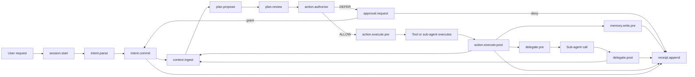

# Frameworks and Standards for Prompt Injection Safety in Agentic Systems

## Executive summary

The strongest 2025–2026 proposals do **not** treat prompt injection primarily as a text-classification problem. The most credible direction is to move security decisions **outside** the main agent LLM and enforce them at stable system boundaries: intent derivation, context ingestion, tool authorization, sub-agent delegation, memory writes, and egress. CaMeL, FIDES, Conseca, AARM, and IBAC all converge on this architectural point from different angles: control/data-flow separation, information-flow control, contextual policy generation, runtime action mediation, and intent-scoped authorization. citeturn16view0turn16view2turn29view0turn16view3turn13view6

Detection-centric systems remain useful, especially as defense-in-depth layers, but the 2025–2026 literature repeatedly shows that heuristic or LLM-judge defenses are brittle against adaptive attackers. The strongest public challenge results show that many recent jailbreak and prompt-injection defenses can be bypassed at high rates under stronger attack optimization, and multi-agent “alignment check” defenses can be evaded by control-flow hijacking attacks. That makes scanners, critics, and replay-based defenses important **plugins**, but poor choices for the **normative core** of a hook standard. citeturn6search1turn19search7turn20search0

For a standardized hook surface intended to support **CaMeL, FIDES, AARM, and IBAC together**, the best current public substrate is the combination of:  
**runtime interception semantics** from ACS and AARM; **argument-level provenance and labels** from FIDES and CaMeL; **per-request intent and escalation semantics** from IBAC; and **portable provenance schemas** from PROV-AGENT / Flowcept. Google’s 2025–2026 whitepapers and Chrome defenses reinforce the same practical requirements: well-defined human controllers, constrained powers, observability, isolated post-plan critics, and origin-aware restrictions. citeturn13view0turn16view3turn36view0turn28view0turn25view0

The hook standard should therefore be small, typed, and opinionated about semantics. The most important primitives are: **intent parse/commit**, **context ingest with trust and lineage**, **action authorize with per-argument provenance**, **delegation hooks for inter-agent control flow**, **memory-write mediation**, **approval/defer flows**, and **tamper-evident receipts**. Those primitives are sufficient to host deterministic policies from CaMeL/FIDES/IBAC/AARM, while allowing optional detectors such as LlamaFirewall, MELON, AgentSentry, or Chrome-style critics to plug in above them. citeturn16view0turn16view2turn16view3turn13view6turn17view1turn17view0turn25view0

## Scope and selection criteria

I treated the four target papers named in the prompt as **CaMeL, FIDES, AARM, and IBAC**. I then looked for 2025–2026 public materials that explicitly address one or more of: **prompt injection**, **instruction-following attacks**, **confused deputy / control-flow hijacking**, or **data provenance / propagation** in agentic or multi-agent systems. I prioritized primary sources: papers, official specifications, official GitHub repositories, official vendor/security blogs, and OWASP/MCP documentation. I excluded pure benchmark-only artifacts from the main tables unless they materially affected confidence in evaluation claims. citeturn16view0turn16view2turn16view3turn13view6turn25view5turn25view3

A note on one term from your request: I did **not** find a public, primary-source **ASHP** specification in the reviewed public sources. I therefore treat **ACS** as the nearest public hook-standard analogue, and I treat ASHP as an internal or otherwise non-public artifact unless you intended a different public source.

## Comparison of identified frameworks and standards

Compatibility ratings in the tables below use the four target papers as anchors: **C** = CaMeL, **F** = FIDES, **A** = AARM, **I** = IBAC.  
**H** means directly expressible or naturally supported by the item; **M** means supportable with extensions; **L** means mostly orthogonal.

### Research frameworks and technical proposals

| Item | Authors / org / date | Primary source | Short abstract | Threat model addressed | Mitigation and required hook implications | Provenance / propagation model | Compatibility, maturity, notable evaluation |
|---|---|---|---|---|---|---|---|
| **CaMeL** | Debenedetti et al.; arXiv Mar 2025, SaTML 2026 | Paper; repo; ADK sample. citeturn16view0turn16view1turn33search1turn33search4 | Separates trusted control flow from untrusted data by compiling the trusted request into a restricted program and enforcing capability-aware tool policies. | Direct and indirect prompt injection via untrusted tool outputs or retrieved content; exfiltration through consequential tool calls. | Requires hooks for `intent.commit`, plan/code generation, typed `tool.pre`, `tool.post`, and `egress.authorize`; especially needs **per-argument dependency capture** before tool execution. | Strong lineage model: control/data-flow separation plus capability-style data-flow restrictions on values and tool arguments. | **C:H F:H A:M I:H**. Research artifact, not production-supported. ArXiv abstract reports **77%** secure utility vs. **84%** undefended in AgentDojo, while the author publication page reports **67%**, so utility should be treated as version-sensitive. citeturn16view0turn16view1 |
| **Conseca** | Tsai, Bagdasarian; HotOS 2025 | Paper; Google publication page; Gemini CLI implementation surface. citeturn29view0turn28view1turn28view2turn30view0turn31view2 | Generates **just-in-time, contextual, human-verifiable policies** using only trusted context, then enforces them deterministically on agent actions. | Harmful or contextually inappropriate actions; prompt injection through attacker-controlled context. | Requires hooks for `session.start`, `intent.parse`, `trusted_context.extract`, `policy.generate`, and `action.authorize`. Distinctive requirement: the policy-generation hook must be able to run on a **trusted-context subset**. | Not full workflow provenance, but distinguishes trusted vs. untrusted context and binds policy to trusted context plus task. | **C:M F:M A:H I:H**. Proof-of-concept prototype. Paper exposes a concrete API `set_policy(task, trusted_ctxt)` and `is_allowed(cmd, policy)`. In the prototype, Conseca completed **12.0/20** tasks on average and denied inappropriate actions, versus **12.2/20** for a permissive static policy that did **not** deny inappropriate actions. citeturn31view2turn31view0 |
| **FIDES** | Costa et al.; Microsoft; arXiv May 2025, ICLR 2026 | Paper; Microsoft page; GitHub tutorial. citeturn16view2turn1search12turn18search1turn18search9 | Applies information-flow control to agents by tracking integrity and confidentiality labels and selectively hiding information from the planner. | Prompt injection, privacy leakage, unsafe flows from untrusted inputs to consequential tools. | Requires hooks for `context.ingest`, `plan.view.filter`, `action.authorize`, and `tool.post` with label propagation; the standard must support **label joins** and argument-level checks. | Explicit integrity/confidentiality labels and deterministic flow enforcement; strongest public model for taint-style propagation. | **C:H F:H A:H I:M**. Repo is a tutorial notebook, not a full framework. Microsoft’s evaluation summary says appropriate policies stop all prompt-injection attacks in the benchmark suite and that FIDES completes **8%** more tasks than a basic planner with GPT-4o, rising to **16%** with o1. citeturn1search8turn16view2 |
| **MELON** | Zhu et al.; ICML 2025 | Paper; PMLR; official repo. citeturn16view4turn19search5turn19search0turn19search10 | Detects indirect prompt injection by re-executing trajectories with a masked user prompt and comparing the resulting actions. | Indirect prompt injection in tool-augmented agents. | Requires hooks for **trajectory snapshots**, `tool.post`, and a replay / `trajectory.reexecute` extension. Best treated as a pluggable defense service, not the normative core. | Weak provenance needs compared with CaMeL/FIDES; depends more on trajectory replay than persistent lineage. | **C:M F:M A:M I:L**. Official implementation exists. Paper claims state-of-the-art attack prevention and utility preservation on AgentDojo; public summaries report strong results and a MELON-Aug variant, but the core value for your standard is the replay hook requirement. citeturn16view4turn19search2 |
| **LlamaFirewall** | Chennabasappa et al.; Meta; arXiv May 2025 | Paper; GitHub; docs/site. citeturn17view1turn13view4turn13view5turn11search1 | Modular guardrail framework with PromptGuard 2, AlignmentCheck, CodeShield, and custom scanners for agent inputs, reasoning, and outputs. | Prompt injection, misalignment, insecure code generation in agents. | Requires scan hooks at `input.pre`, `plan.review`, `output.pre`, and `tool.pre`; if chain-of-thought or reasoning traces are available, AlignmentCheck can consume them. | Minimal built-in lineage; mostly scanner orchestration across lifecycle stages. | **C:M F:L A:M I:L**. Mature open-source implementation relative to most research artifacts. Good as a consumer of hooks, but later work showed “alignment check” style defenses can be bypassed in multi-agent control-flow attacks. citeturn17view1turn13view4turn20search0 |
| **AARM** | Herman Errico; arXiv Feb 2026; docs repo | Paper; spec/docs; threat documentation. citeturn16view3turn13view2turn13view3turn2search8 | Open system specification for intercepting, authorizing, and auditing AI-driven actions before execution, with accumulated session context and tamper-evident receipts. | Prompt injection, confused deputy, data exfiltration, intent drift, cross-agent propagation, environmental manipulation. | Directly requires hooks for `action.intercept`, `context.accumulate`, `policy.evaluate`, `decision.enforce`, and `receipt.append`. This is the closest public articulation of the **runtime control-plane** problem. | Session-context accumulation rather than rich value lineage; emphasizes receipts and forensic reconstruction. | **C:M F:H A:H I:H**. Spec/docs stage; no public production implementation surfaced in reviewed sources. Strongest single reference for decision semantics and receipts. citeturn16view3turn13view2turn13view3 |
| **IBAC** | Jordan Potti; public paper Apr 2026 | Paper PDF. citeturn13view6turn14view0turn14view3 | Derives per-request permissions from explicit user intent and enforces them deterministically at tool invocation time, so compromised reasoning cannot expand authority. | Prompt injection, excessive permission scope, exfiltration through over-broad tool access. | Requires `intent.parse`, `intent.commit`, `action.authorize`, resource/recipient matching, and a first-class `DEFER` / approval escalation hook. | Weak on fine-grained lineage by itself, but excellent on **authorization scope** and escalation provenance. | **C:H F:M A:H I:H**. Prototype/paper stage. Evaluated on AgentDojo workspace suite: **100% security** in strict mode, **98.8%** in permissive mode, with about **9 ms** authorization latency per tool invocation and one extra LLM call for intent parsing. citeturn14view0turn14view3 |
| **AgentSentry** | Zhang et al.; arXiv Feb 2026 | Paper. citeturn17view0 | Models multi-turn indirect prompt injection as a **temporal causal takeover**, then localizes takeover points and purifies context to continue safely. | Multi-turn indirect prompt injection in tool-augmented agents. | Requires `tool.post`, `trajectory.snapshot`, counterfactual replay, and a `context.purify` or `context.rewrite` extension. | Uses causal localization over trajectories rather than persistent provenance graphs. | **C:M F:M A:M I:L**. Paper/preprint stage; no public repo surfaced in reviewed primary sources. Reports **74.55% Utility Under Attack**, improving the strongest baselines by **20.8–33.6 points** without benign-performance degradation. citeturn17view0 |
| **ControlValve** | Jha et al.; preprint Oct 2025 | Paper / preprint. citeturn20search0turn20search2turn21search9 | Defends multi-agent systems by generating a permitted control-flow graph and enforcing contextual rules on each agent invocation. | Control-flow hijacking in multi-agent systems, explicitly framed as a form of indirect prompt injection targeting orchestration. | Requires `delegate.pre`, `delegate.post`, topology identifiers, CFG/edge-policy registration, and inter-agent message metadata. | Focuses on propagation of **control flow** more than content lineage; very relevant for A2A hooks. | **C:M F:M A:H I:M**. Preprint/research stage; no public production-quality implementation surfaced in reviewed primary sources. Important because it shows plain “alignment-check” delegation gates are not enough. citeturn20search0 |
| **PROV-AGENT / Flowcept** | Souza et al.; IEEE e-Science 2025; ORNL Flowcept | Paper; Flowcept repo/site/docs. citeturn36view0turn38search0turn38search1turn38search8 | Extends W3C PROV and leverages MCP to capture prompts, responses, decisions, and workflow effects in agentic workflows, with near-real-time open-source collection. | Error propagation, hallucination propagation, workflow reliability, and downstream accountability; indirectly useful for injection forensics and propagation tracking. | Requires event hooks for prompts, responses, decisions, tool calls, and downstream effects. Best reference for **portable provenance schema**, not inline prevention. | Strongest provenance/propagation model in the surveyed set; explicitly designed for end-to-end workflow lineage. | **C:H F:H A:H I:M**. Open-source implementation exists in Flowcept. Evaluation spans edge, cloud, and HPC and demonstrates support for provenance queries and reliability analysis. citeturn36view0turn38search0turn38search8 |
| **Cross-Agent Multimodal Provenance-Aware Defense Framework** | Syed, Almutairi, Abdel Moaty; arXiv Dec 2025 | Paper. citeturn35search0turn35search4 | Proposes text and visual sanitizers, an output validator, and a provenance ledger to prevent multimodal prompt injection from propagating across agent graphs. | Multimodal and inter-agent prompt injection through text, images, metadata, and agent-to-agent messages. | Requires modality-specific `context.ingest`, sanitizer hooks, downstream `message.pre_send` validation, and provenance ledger updates. | Explicit source / modality / trust metadata across the agent network; useful for future multimodal hook extensibility. | **C:M F:M A:M I:L**. Proposal/preprint stage; public evaluation claims are still lightweight relative to stronger systems papers. Good forward-looking input for multimodal support. citeturn35search0turn35search4 |

### Standards, whitepapers, and industry proposals

| Item | Org / date | Primary source | What it contributes | Hook implications | Provenance / propagation implications | Maturity and practical value |
|---|---|---|---|---|---|---|
| **ACS** | Agent Control Standard; public 2026 standard effort | Website; GitHub org/repo. citeturn13view0turn13view1turn5search1turn5search2 | Public hook-oriented standard effort: standardized middleware hooks across input, output, tool calls, tool selection, planning/execution transition, memory, code execution, and sub-agents, with allow/deny/modify decisions. | Closest public analogue to the hook standard you are designing. Strong on interception points, but currently weaker than FIDES/CaMeL/IBAC on typed intent and argument-level provenance semantics. | Mentions AgBOM and planned MCP / A2A integration, but does not yet expose a mature provenance model comparable to PROV-AGENT. | Spec in active evolution; no releases yet. Very high relevance as substrate and naming precedent. citeturn13view1turn5search5 |
| **Google’s Approach for Secure AI Agents** | Google; publication page 2025 | Whitepaper / publication page. citeturn28view0turn26search1 | Aspirational defense-in-depth framework grounded in three principles: **well-defined human controllers**, **carefully limited powers**, and **observable actions and planning**. | Strong normative guidance for standard design: hooks should expose controller identity, capability boundaries, and auditable planning/action traces. | Supports observability and controlled delegation rather than a concrete provenance DSL. | Whitepaper / best-practices level, but from a major deployer and conceptually aligned with AARM/ACS. citeturn28view0 |
| **Chrome agentic browsing defenses** | Google Chrome security blog; Dec 2025 | Official security blog. citeturn24search1turn25view0 | Introduces an isolated **User Alignment Critic** that sees only action metadata, plus **Agent Origin Sets** and user confirmations for sensitive navigation or actions. | Strong evidence for a dedicated `plan.review` hook with **metadata-only visibility**, plus origin/scope metadata on browsing contexts and high-risk egress approval gates. | Origin scoping is a practical propagation-control primitive: where did the action context come from, and is it in-scope for the user’s task? | Deployed product proposal. Useful for browser and cross-origin agent settings. citeturn25view0 |
| **MCP security best practices and user-controlled prompts** | Model Context Protocol; docs current in 2025–2026 | Security docs; prompt spec; annotations blog. citeturn25view3turn25view4turn23search10 | Formalizes security concerns like confused deputy risk; requires prompts to be **user-controlled**; clarifies that static tool annotations do not themselves solve prompt injection. | Standard should distinguish **user-selected prompts** from ambient server-provided prompts, and should carry authorization context on MCP-originated tools/resources/prompts. | Important for provenance: remote prompts/resources must carry origin and trust metadata; annotations alone are insufficient. | Mature protocol guidance, though not a complete prompt-injection defense framework. High interoperability value. citeturn25view3turn25view4turn23search10 |
| **OWASP Agentic Top 10 2026 and LLM01:2025** | OWASP GenAI Security Project; Dec 2025 onward | Agentic Top 10; LLM01 page. citeturn25view5turn22search1 | Provides the most widely shared public risk taxonomy for autonomous agents, with prompt injection still a top-class issue and agentic risks framed explicitly. | Best used as a **conformance and threat-mapping layer** for the standard rather than as a hook design source. | Encourages standardized logging, testing, and control coverage across agentic attack surfaces. | High maturity as community guidance; low direct protocol detail. citeturn25view5turn22search1 |
| **OWASP AI Testing Guide v1** | OWASP; Nov 2025 | Testing guide. citeturn25view6 | First open, community-driven testing standard for AI trustworthiness, including adversarial manipulation, unsafe agency, misalignment, and data/model risks. | Your standard should ship with a **test profile** and adversarial harness requirements derived from this style of guidance. | Supports traceability expectations for what to log and test, though not a provenance schema itself. | High value for verification and certification, even though it is not a runtime control framework. citeturn25view6 |

## What the proposals imply for a hook standard

The surveyed proposals fall into three families.

The first family is **deterministic mediation**: CaMeL, FIDES, Conseca, AARM, and IBAC. These systems differ in where they derive policy—program synthesis, IFC labels, contextual policy generation, runtime mediation, or intent authorization—but they all assume the same thing: the LLM’s reasoning layer is **not** a trustworthy security boundary, so policy must be evaluated elsewhere. This family should drive the core hook semantics. citeturn16view0turn16view2turn29view0turn16view3turn13view6

The second family is **defense-in-depth detection and replay**: LlamaFirewall, MELON, AgentSentry, and Chrome’s User Alignment Critic. These are valuable because they catch some attacks earlier, reduce user friction, and create additional veto points. But their design should be modeled as **hook consumers**, not as the hook substrate itself. The standard should give them structured access to user input, retrieved context, tool metadata, proposed actions, and post-action traces. It should not assume they will always be correct. citeturn17view1turn16view4turn17view0turn25view0

The third family is **provenance and interoperability**: PROV-AGENT / Flowcept, ACS, MCP guidance, and OWASP testing/risk taxonomies. These do not by themselves stop prompt injection, but they define the surrounding ecosystem that will make a hook standard portable, auditable, and testable. In practice, the standard should borrow **interception** from ACS/AARM, **lineage** from FIDES/CaMeL, **authorization scope** from IBAC, and **portable provenance representation** from PROV-AGENT. citeturn13view0turn16view3turn16view2turn16view0turn13view6turn36view0

## Prioritized candidates to incorporate into the hook standard

### Highest-priority incorporations

1. **ACS plus AARM for the runtime control plane.**  
   If the goal is a standardized hook layer, ACS and AARM are the closest public proposals to your target problem. ACS already names the agent decision points where hooks should fire, and AARM gives stronger semantics around interception-before-execution, accumulation of session context, policy evaluation, and tamper-evident receipts. What they still need—and what your standard can add—is a stronger schema for typed intent, argument-level provenance, and propagation across MCP/A2A boundaries. citeturn13view0turn13view1turn16view3turn13view2

2. **FIDES and CaMeL for data lineage and action semantics.**  
   These are the strongest public sources for deterministic, argument-level control of how untrusted data influences tool execution. FIDES contributes label-based flow control; CaMeL contributes explicit dependency capture and capability reasoning. A hook standard that cannot carry **which action arguments are derived from which prior observations** will not support either paper well. citeturn16view2turn16view0

3. **IBAC for intent, scope, and escalation.**  
   IBAC is the most deployment-friendly of the four target papers because it can retrofit existing agents with one additional intent-parsing step and deterministic authorization checks. It is also the clearest source for a first-class `DEFER` / approval pattern, which is missing or underspecified in much of the earlier literature. Your standard should treat escalation as a standard outcome, not an ad hoc application behavior. citeturn13view6turn14view3

4. **PROV-AGENT / Flowcept for provenance portability.**  
   Most of the security proposals rely on provenance-like reasoning without defining a portable provenance model. PROV-AGENT is the best 2025 public reference for turning prompts, responses, decisions, and workflow effects into end-to-end queryable provenance, and it explicitly aligns with W3C PROV and MCP. This is the right place to borrow naming and graph structure for propagation metadata. citeturn36view0turn38search0turn38search8

### Important, but better as extensions

5. **Conseca for trusted-context policy generation.**  
   Conseca is especially valuable when the “right” action depends on current user- or environment-specific context and cannot be captured by a static policy bundle. It points to a useful extension point: a `policy.generate` hook that accepts **trusted context only**, produces a human-verifiable policy, and binds that policy to the request. That capability is complementary to IBAC and AARM, but it should remain optional because not every deployment will accept model-generated policy artifacts. citeturn29view0turn31view2

6. **ControlValve and Chrome’s origin-aware checks for delegation.**  
   Multi-agent propagation is under-specified in most of the literature. ControlValve shows that control-flow integrity matters, while Chrome’s Agent Origin Sets show that origin scoping is a practical deployment primitive. If your standard wants to survive the move from single agents to agent graphs, it needs explicit **delegation hooks**, control-edge identifiers, and source-origin metadata. citeturn20search0turn25view0

7. **LlamaFirewall, MELON, and AgentSentry as pluggable veto layers.**  
   These proposals are useful and often open-source, but they should sit on top of the standard rather than define it. In the current evidence base, they are best understood as high-value **consumers** of standardized hooks for scanning, replay, purification, and reasoning checks. Adaptive-attack papers are a strong warning against making them the only line of defense. citeturn17view1turn16view4turn17view0turn6search1turn19search7

## Recommended hook primitives and semantics

The table below is the smallest hook set I would standardize first if the objective is to support the four target papers together while remaining extensible to later proposals.

| Primitive | When it fires | Required input | Required output | Normative semantics | Why it matters |
|---|---|---|---|---|---|
| **`session.start`** | New user request / session root | `session_id`, `user_id`, raw request, platform context, declared policy mode | session handle, root receipt hash | Opens a new security boundary and receipt chain; no untrusted context may be silently prebound. | Needed by AARM, ACS, IBAC. citeturn16view3turn13view0turn13view6 |
| **`intent.parse`** | Before planning begins | raw user request, trusted request metadata only | `IntentCandidate` + parser provenance | Produces structured intent/capability candidate from trusted inputs only. | Core for IBAC; useful for CaMeL and Conseca. citeturn13view6turn16view0turn29view0 |
| **`intent.commit`** | After parse, before any untrusted data enters | `IntentCandidate`, parser provenance, policy scope mode | immutable `IntentRef` | Once committed, authority cannot be expanded except through explicit approval / intent extension. | Prevents later prompt injection from rewriting authority. citeturn13view6 |
| **`context.ingest`** | Every time data enters the agent from user, tool, memory, document, web page, MCP resource, or sub-agent | `source_id`, `origin`, `modality`, `content_ref`, `trust`, optional confidentiality/readers, parent refs | `ProvenanceRef` | Every externally sourced datum must receive provenance at ingress; trust can only stay the same or decrease unless explicitly promoted by a verifier. | Essential for FIDES, CaMeL, PROV-AGENT, multimodal proposals. citeturn16view2turn16view0turn36view0turn35search0 |
| **`plan.propose`** | Planner emits a next action or plan fragment | `IntentRef`, working-set provenance refs, tool catalog, policy summary | `ActionCandidate` or `PlanCandidate` | Pure proposal step; no side effects. Candidate must list data dependencies used for each action argument where available. | Separates reasoning from enforcement; supports auditability. citeturn16view0turn28view0 |
| **`plan.review`** | Optional isolated review before execution | action metadata, intent summary, origin set / scoped context, but not raw untrusted payload unless requested | `ALLOW / DENY / MODIFY / DEFER` + rationale | Reviewers can veto or narrow candidates without being fully exposed to attacker-controlled context. | Supports Chrome-style isolated critics and LlamaFirewall-style review. citeturn25view0turn17view1 |
| **`action.authorize`** | Immediately before any consequential action | typed action, tool name, args, `IntentRef`, arg provenance refs, session summary | decision, obligations, expiry | Security decision must occur **outside** the planner LLM; `DEFER` is first-class; authorization is deterministic once inputs are fixed. | The central hook for AARM, IBAC, FIDES, CaMeL. citeturn16view3turn13view6turn16view2turn16view0 |
| **`action.execute.pre`** | After allow, before execution | authorized action, obligations, execution environment metadata | execution token | Binds the planned action to the approved action; environment mismatch invalidates the token. | Useful for code exec, browser actions, sub-processes, and high-risk tools. citeturn13view0turn16view3 |
| **`action.execute.post`** | After execution returns | execution token, raw result, observed effects, destination metadata | result provenance ref + effect record | Tool outputs get fresh provenance; side effects are recorded separately from returned content. | Needed for propagation, egress forensics, and memory safety. citeturn16view2turn36view0 |
| **`memory.write.pre`** | Before storing long-lived memory or cached context | memory entry, namespace, TTL, provenance refs, trust label | `ALLOW / DENY / MODIFY / DEFER` | Memory is just another consequential sink. Untrusted or mixed-trust context cannot be silently persisted. | Important because memory poisoning is a recurring unresolved risk. citeturn2search9turn25view2 |
| **`delegate.pre`** | Before invoking a sub-agent or sending an inter-agent message | target agent, control-edge id, message, provenance refs, parent/session intent | decision + delegated scope | Delegation is a consequential action with its own scope and provenance obligations. | Required for ControlValve, multimodal cross-agent defenses, A2A-style propagation. citeturn20search0turn35search0turn13view1 |
| **`delegate.post`** | When a sub-agent returns | target agent, result, result provenance refs | provenance ref + child receipt | Child-agent results must re-enter through the same provenance boundary as any other external context. | Stops “trusted by topology” assumptions in agent graphs. citeturn20search0turn36view0 |
| **`approval.request`** | When policy yields `DEFER` | concrete requested extension, resource/recipient, human-readable rationale, expiry | grant / deny + optional intent delta | Approval must be narrow, explicit, time-bounded, and auditable. | Core for IBAC, and broadly useful for AARM/ACS. citeturn13view6turn16view3 |
| **`receipt.append`** | After each security-relevant decision | event payload, previous hash | new receipt hash | Produces tamper-evident audit chain over intents, context ingress, decisions, execution, and approvals. | Strongly aligned with AARM and useful for ACS-style governance. citeturn16view3turn13view2 |

A few semantics should be standardized, not left to library implementers.

First, **lineage must be monotonic**. Anything derived from untrusted input stays untrusted unless a specific verifier hook promotes it, and that promotion must itself be recorded with evidence. This is the shared intuition behind FIDES, CaMeL, Conseca’s trusted-context isolation, and Google’s isolated critic designs. citeturn16view2turn16view0turn30view0turn25view0

Second, **authorization must be based on structured intent and typed action metadata, not natural-language self-report from the planner**. That is the common denominator across IBAC, AARM, and Google’s secure-agent guidance. citeturn13view6turn16view3turn28view0

Third, **the standard should distinguish three classes of metadata**:  
`Intent` for what the user authorized, `Provenance` for where data came from and how it propagated, and `Receipt` for what the control plane decided and why. Mixing those into one event payload is what makes many current systems hard to audit and hard to compose. PROV-AGENT is the best current public model for the provenance half of that split. citeturn36view0turn38search0

## Hook integration flow and open gaps

The following flow shows how the recommended hooks fit into a typical agent pipeline while remaining compatible with the target papers.

Across the proposals, the largest gaps are now fairly clear.

There is still **no shared, typed schema** for action arguments plus lineage. CaMeL and FIDES both need it, IBAC increasingly benefits from it, and ACS/AARM are not yet opinionated enough about it. This is the single most important gap your hook standard can fill. citeturn16view0turn16view2turn13view6turn13view0turn16view3

There is also no consensus on **cross-agent propagation semantics**. ControlValve, PROV-AGENT, the multimodal provenance-aware framework, Chrome’s origin restrictions, and MCP security guidance all point toward the same need: every delegation and every imported prompt/resource/message should carry origin and scope metadata, and those edges should be auditable. citeturn20search0turn36view0turn35search0turn25view0turn25view3

A further gap is **memory safety**. The field now recognizes long-term-memory poisoning as a concrete problem, but the major runtime frameworks still underspecify how memory reads and writes should be mediated. Standardizing `context.ingest(origin=memory)` and `memory.write.pre` would close a real blind spot without forcing a specific memory implementation. citeturn2search9turn25view2

Finally, the empirical literature still strongly suggests that **probabilistic detectors alone are not reliable enough** to be the main security boundary. The strongest hook standard should therefore make capability confinement, lineage, scope control, delegation control, and explicit approvals mandatory, while treating scanners, critics, and replay defenses as optional but valuable extensions. citeturn6search1turn19search7turn20search0

### Open questions and limitations

I did not find a public primary-source **ASHP** specification in the reviewed sources, so I could not compare it directly against ACS or map it rigorously into the candidate set.

A few evaluation details are inconsistent across sources. The most notable example is **CaMeL**, where the arXiv abstract reports **77%** secure utility while the author publication page reports **67%**. I therefore treat the main CaMeL conclusion as robust—strong deterministic security with a moderate utility cost—but the exact utility number as version-sensitive. citeturn16view0turn16view1

Several important proposals remain **preprints, specs, or research artifacts** rather than hardened production systems, including AARM, IBAC, AgentSentry, and ControlValve. That does not reduce their relevance for a standard; it does mean their interfaces may still move. citeturn16view3turn13view6turn17view0turn20search0